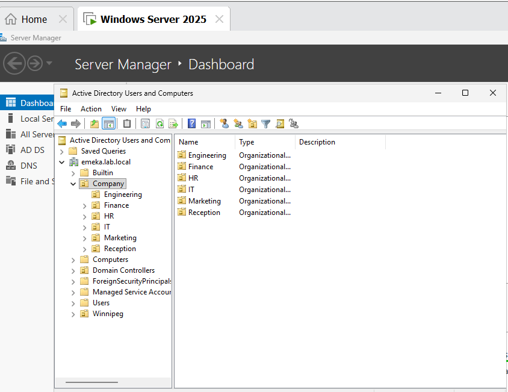
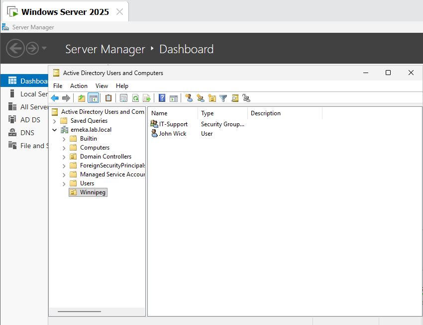
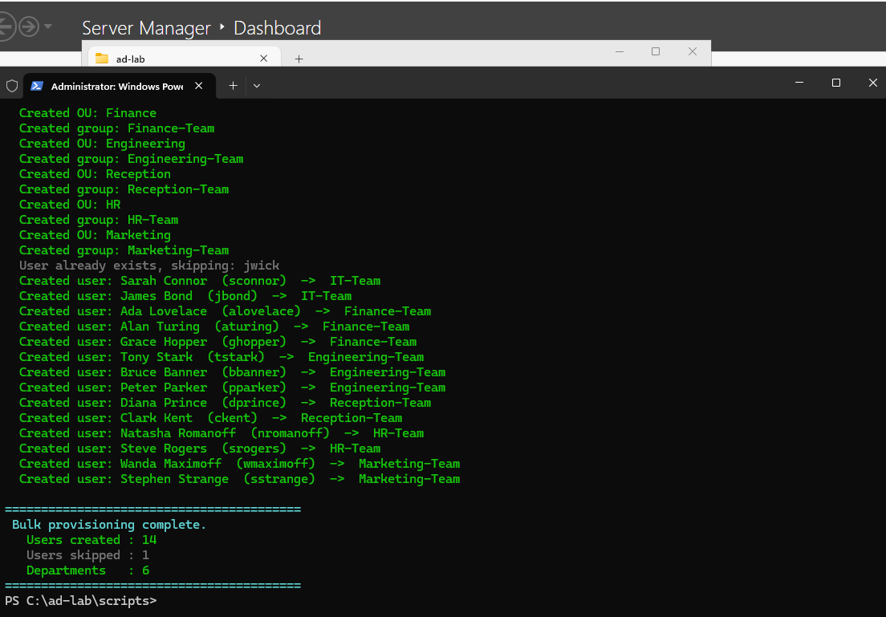
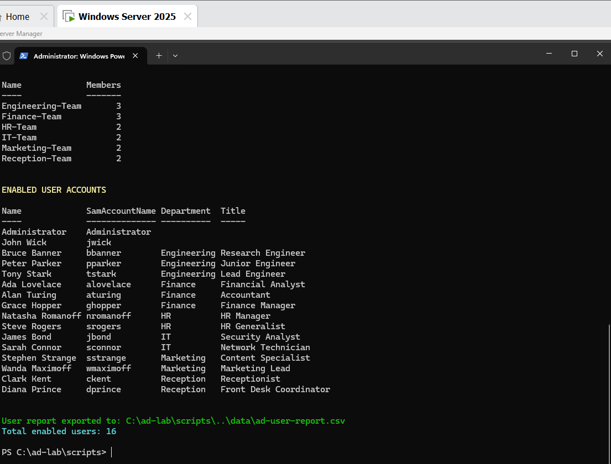

# Windows Server 2025 Active Directory Home Lab

A hands-on lab that builds a small Windows domain from scratch in VMware Workstation Pro: a **Windows Server 2025** domain controller running **Active Directory Domain Services, DNS, and DHCP**, with bulk user provisioning via **PowerShell** — and a Windows 11 client domain join as the next phase.

The goal of this project is to practise and document the core skills of a service-desk / MSP technician: standing up Windows Server, building identity and network services, automating administration with PowerShell, and writing the kind of clear, reproducible documentation an IT team keeps in its knowledge base.

> **Status:** Phases 1–5 complete (domain controller, AD DS, DNS, OU structure, users/groups, DHCP). Phase 6 — client domain join and Group Policy — in progress.

---

## Lab Architecture

| Component | Detail |
|---|---|
| **Hypervisor** | VMware Workstation Pro on Windows 11 Pro host (Intel i7-1185G7, 16 GB RAM) |
| **Domain Controller** | `DC01` — Windows Server 2025 Standard (Desktop Experience) |
| **VM specs** | 2 vCPU, 4 GB RAM, 60 GB disk, NAT networking |
| **Domain** | `emeka.lab.local` (NetBIOS: `EMEKA`) |
| **DC01 static IP** | `192.168.8.10` /24, gateway `192.168.8.2` |
| **DNS** | AD-integrated, forwarders to `192.168.8.2` and `8.8.8.8` |
| **DHCP scope** | `LAB-Clients` — 192.168.8.50–192.168.8.99, printer reservation at `.55` |
| **Client (next phase)** | Windows 11 VM, domain-joined and managed via Group Policy |

### Network Diagram

```
                    VMware NAT (VMnet8) — 192.168.8.0/24
                    ┌──────────────────────────────────┐
                    │  Gateway: 192.168.8.2            │
                    │                                  │
   ┌────────────────┴────────────┐      ┌──────────────┴─────────────┐
   │  DC01 (Windows Server 2025) │      │  CLIENT01 (Windows 11)     │
   │  192.168.8.10 (static)      │◄─────│  DHCP: 192.168.8.50–.99    │
   │  AD DS · DNS · DHCP         │      │  Domain join — in progress │
   └─────────────────────────────┘      └────────────────────────────┘
```

---

## Skills Demonstrated

| Area | What this lab shows |
|---|---|
| **Windows Server OS** | Installing and configuring Windows Server 2025 (Desktop Experience), roles & features |
| **Active Directory (AD DS)** | Promoting a server to a domain controller, creating a new forest, OU design, users and security groups |
| **PowerShell automation** | Bulk-provisioning OUs, groups, and users from CSV with a single script |
| **DNS** | AD-integrated zones, configuring forwarders, verifying resolution |
| **DHCP** | Installing and authorizing DHCP in AD, scope creation, options, and reservations |
| **IP networking** | Static addressing, subnetting, gateway/DNS client configuration, connectivity testing |
| **Virtualization** | Provisioning and managing VMs in VMware Workstation Pro, snapshots, NAT networking |
| **Troubleshooting** | `dcdiag`, `nltest`, `ipconfig`, `Test-NetConnection`, Event Viewer |
| **Documentation** | This repository — clear, reproducible, screenshot-supported technical writing |

---

## Build Phases

### Phase 1 — Host & VM Provisioning ✅

- Installed VMware Workstation Pro on the Windows 11 host.
- Created the DC01 VM: 2 vCPUs, 4 GB RAM, 60 GB disk (split), NAT networking.
- Installed **Windows Server 2025 Standard (Desktop Experience)** from ISO.
- **Lesson learned:** VM files must live *outside* any cloud-synced folder. Early builds were lost when Google Drive synced and removed `.vmdk` files. VMs now live in a local, sync-excluded directory (e.g. `C:\VMs\`).


### Phase 2 — Server Configuration ✅

- Renamed the server to `DC01`.
- Assigned a static IP:

```powershell
New-NetIPAddress -InterfaceAlias "Ethernet0" -IPAddress 192.168.8.10 `
  -PrefixLength 24 -DefaultGateway 192.168.8.2
Set-DnsClientServerAddress -InterfaceAlias "Ethernet0" -ServerAddresses 127.0.0.1
```


### Phase 3 — AD DS & DNS ✅

- Installed the AD DS role and promoted DC01 to a domain controller for a **new forest**: `emeka.lab.local`.

```powershell
Install-WindowsFeature AD-Domain-Services -IncludeManagementTools

Install-ADDSForest -DomainName "emeka.lab.local" -DomainNetbiosName "EMEKA" `
  -InstallDns -SafeModeAdministratorPassword (Read-Host -AsSecureString "DSRM password")
```

- Configured DNS forwarders so lab machines resolve internet names:

```powershell
Set-DnsServerForwarder -IPAddress 192.168.8.2, 8.8.8.8
```

- Verified promotion:

```powershell
dcdiag /q
Get-ADDomain | Select-Object DNSRoot, NetBIOSName, DomainMode
Resolve-DnsName emeka.lab.local
```


### Phase 4 — OU Structure, Groups & Bulk User Provisioning ✅

A single PowerShell script builds the org structure and provisions users from CSV:

- **Company** parent OU
- Six department OUs: **IT, Finance, Engineering, Reception, HR, Marketing**
- Six matching security groups
- **15 users** imported from `users.csv`

```powershell
# Create parent OU
New-ADOrganizationalUnit -Name "Company" -Path "DC=emeka,DC=lab,DC=local"

# Create department OUs and security groups
$departments = "IT","Finance","Engineering","Reception","HR","Marketing"
foreach ($dept in $departments) {
    New-ADOrganizationalUnit -Name $dept -Path "OU=Company,DC=emeka,DC=lab,DC=local"
    New-ADGroup -Name "$dept-Group" -GroupScope Global -GroupCategory Security `
      -Path "OU=$dept,OU=Company,DC=emeka,DC=lab,DC=local"
}

# Bulk-create users from CSV (FirstName,LastName,Username,Department)
Import-Csv .\users.csv | ForEach-Object {
    New-ADUser -Name "$($_.FirstName) $($_.LastName)" `
      -SamAccountName $_.Username `
      -UserPrincipalName "$($_.Username)@emeka.lab.local" `
      -Path "OU=$($_.Department),OU=Company,DC=emeka,DC=lab,DC=local" `
      -AccountPassword (ConvertTo-SecureString "TempP@ss123!" -AsPlainText -Force) `
      -ChangePasswordAtLogon $true -Enabled $true
    Add-ADGroupMember -Identity "$($_.Department)-Group" -Members $_.Username
}
```

Verification:

```powershell
Get-ADUser -Filter * -SearchBase "OU=Company,DC=emeka,DC=lab,DC=local" |
  Measure-Object   # → 15 users
Get-ADOrganizationalUnit -Filter * | Select-Object Name
```









### Phase 5 — DHCP ✅

- Installed and authorized DHCP in Active Directory:

```powershell
Install-WindowsFeature DHCP -IncludeManagementTools
Add-DhcpServerInDC -DnsName "DC01.emeka.lab.local" -IPAddress 192.168.8.10
```

- Created the client scope with router and DNS options, plus a reservation for a network printer:

```powershell
Add-DhcpServerv4Scope -Name "LAB-Clients" -StartRange 192.168.8.50 `
  -EndRange 192.168.8.99 -SubnetMask 255.255.255.0 -State Active

Set-DhcpServerv4OptionValue -ScopeId 192.168.8.0 -Router 192.168.8.2
Set-DhcpServerv4OptionValue -ScopeId 192.168.8.0 -DnsServer 192.168.8.10 -Force

Add-DhcpServerv4Reservation -ScopeId 192.168.8.0 -IPAddress 192.168.8.55 `
  -ClientId "AA-BB-CC-DD-EE-55" -Name "LAB-Printer"
```

- **Troubleshooting note:** setting the DNS server option (OptionId 6) initially failed validation because the DHCP service couldn't verify 192.168.8.10 as a responding DNS server at that moment. Re-running with `-Force` applied the option; resolution was then confirmed from the scope options console.

### Phase 6 — Client Domain Join & Group Policy 🔜 *(in progress)*

- Provision a lightweight Windows 11 client VM (2 vCPU / 2 GB RAM to fit host constraints).
- Point the client at DHCP, confirm it leases from `LAB-Clients`.
- Join `emeka.lab.local` and log in with a provisioned domain user.
- Create and link a baseline GPO (wallpaper/drive-mapping/password policy) and verify with `gpresult /r`.

---

## Troubleshooting Toolkit Used

```powershell
dcdiag /q                          # domain controller health
nltest /dsgetdc:emeka.lab.local    # DC locator test
ipconfig /all                      # client IP configuration
Test-NetConnection 192.168.8.10 -Port 389   # LDAP reachability
Get-DhcpServerv4Lease -ScopeId 192.168.8.0  # active leases
```

Event Viewer paths checked during the build: *Directory Service*, *DNS Server*, and *DHCP-Server* operational logs.

---

## Lessons Learned

1. **Never store VM disks in a cloud-synced folder.** Google Drive sync silently removed `.vmdk` files mid-build, forcing full rebuilds. Local, sync-excluded storage fixed it permanently.
2. **Resource budgeting matters on a 16 GB host.** Two concurrent VMs require trimming RAM allocations and closing host applications — the same capacity-planning mindset used in production.
3. **`-Force` is a tool, not a habit.** The DHCP DNS option failure was worth understanding (validation timing) before overriding it.
4. **Automate from the start.** Provisioning 15 users by hand teaches clicking; provisioning them from CSV teaches administration.

---

## Roadmap

- [x] Windows Server 2025 install and static IP configuration
- [x] AD DS promotion — new forest `emeka.lab.local`
- [x] DNS forwarders and resolution verification
- [x] OU structure, security groups, bulk user provisioning (PowerShell + CSV)
- [x] DHCP install, authorization, scope, options, reservation
- [ ] Windows 11 client domain join
- [ ] Baseline Group Policy (mapped drive, password policy) + `gpresult` verification
- [ ] File server role with department share permissions via security groups
- [x] Screenshots for completed phases (DHCP console screenshot still to add)

---

## About

Built and documented by **Emeka Anolue** — Engineer-in-Training (EGM) with 11+ years in telecom network operations, building hands-on Windows infrastructure skills for IT support and system administration roles.

📫 emekanolue@gmail.com · [github.com/mekzy3184](https://github.com/mekzy3184)
